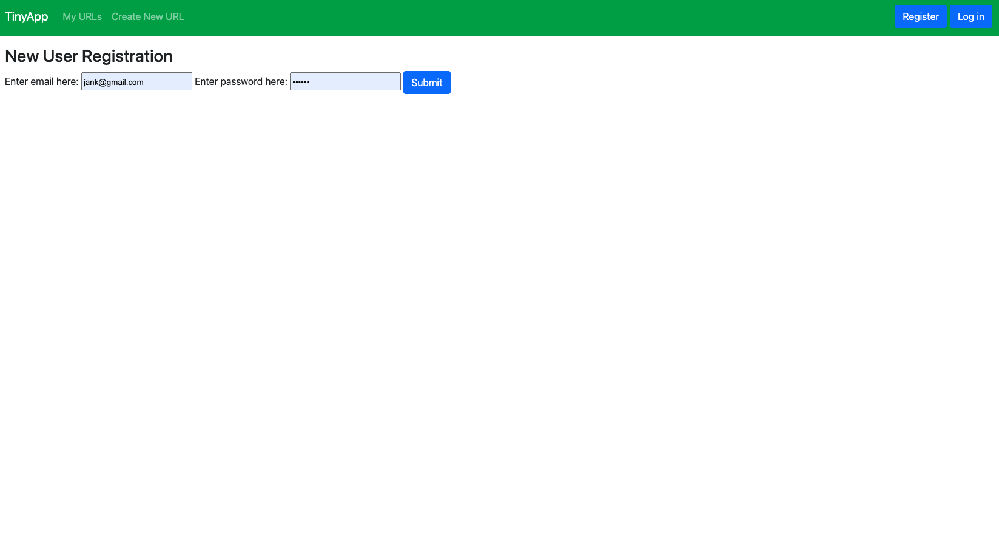
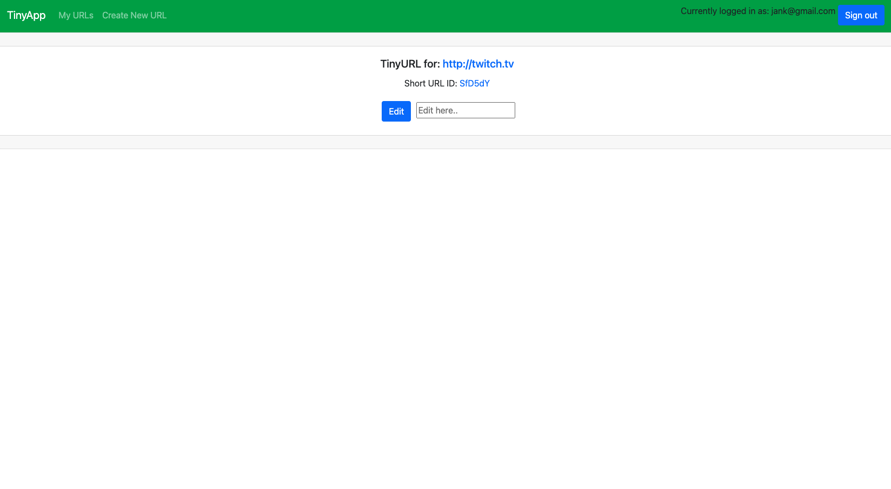

# TinyApp Project

Do you want to be able to share cool images on reddit, but can't cause the file is too long? Worry no more because TinyApp is a full stack web application built with Node and Express that allows users to shorten long URLs.

## Final Product

## Features 

- Shorten URLS. 
- You can edit links that you made a mistake and delete the ones that are no longer needed.

## Getting Started

- Install all dependencies (using the `npm install` command).
- Run the development web server using the `node express_server.js` command.

## How to Use

- Run your node server
- Browse to `http://localhost:3000/`
- Enjoy all its features

## Dependencies

- Node.js
- Express
- EJS
- bcryptjs
- cookie-session